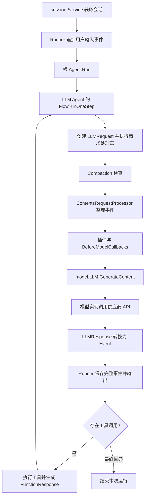

# ADK-Go 原理：从会话事件到模型调用

核查日期：2026-09-26。本文仅依据当前 ADK-Go 仓库源码说明框架行为，涵盖会话事件、请求组装、工具循环、原生上下文压缩及插件扩展机制。未发起真实模型调用。

## 阅读导航

第 1～4 章说明核心对象与启动过程；第 5～9 章说明请求如何组装并发送；第 10～11 章说明事件回流与排查位置；第 12～16 章提供数据示例和压缩机制补充；第 17～21 章说明插件功能、内置实现、组合规则与平滑输出的适用边界。

- [第 1 章：范围与整体链路](#chapter-1)
- [第 2 章：Session、Event 与存储接口](#chapter-2)
- [第 3 章：用户输入进入 Runner](#chapter-3)
- [第 4 章：每轮建立新的模型请求](#chapter-4)
- [第 5 章：历史压缩发生在 Contents 组装之前](#chapter-5)
- [第 6 章：events 转换为 Contents 的详细规则](#chapter-6)
- [第 7 章：工具调用配对与重排](#chapter-7)
- [第 8 章：模型调用前后的回调](#chapter-8)
- [第 9 章：Model 接口与实际模型调用](#chapter-9)
- [第 10 章：响应、工具结果与下一轮](#chapter-10)
- [第 11 章：排查时应观察的四个阶段](#chapter-11)
- [第 12 章：事件与模型输入的 JSON 示例](#chapter-12)
- [第 13 章：压缩事件的存储结构](#chapter-13)
- [第 14 章：两种压缩策略的区别](#chapter-14)
- [第 15 章：Tail retention 的触发示例](#chapter-15)
- [第 16 章：长期会话的记忆边界](#chapter-16)
- [第 17 章：Plugin 的职责与接入位置](#chapter-17)
- [第 18 章：Plugin 生命周期回调与可实现功能](#chapter-18)
- [第 19 章：仓库内的四个现成插件](#chapter-19)
- [第 20 章：插件顺序、短路与能力边界](#chapter-20)
- [第 21 章：平滑流式输出适合放在哪里](#chapter-21)

## 关键结论

- Event 是执行历史，Content 是对话内容，LLMRequest 还包括系统指令、工具声明和生成配置。
- 每轮模型调用重新整理当前历史，同一组 events 对不同 Agent 可能生成不同上下文。
- 历史可能经过过滤、摘要替换和工具配对，不会简单逐条原样发送。
- 压缩由显式配置启用，阈值和保留量由调用方设置；压缩阈值不是请求大小硬上限。
- 模型响应和工具结果进入会话后，下一轮重新构造请求，一次用户输入可以触发多次模型调用。


<a id="chapter-1"></a>

## 第 1 章：范围与整体链路

本文说明 ADK-Go 如何从 `session.Event` 构造模型请求，并在模型回复、工具执行和上下文压缩之间推进运行。重点是普通 `Runner.Run()` / `Flow.Run()` 链路；双向实时的 `RunLive()` 有独立流程，不在本文逐步展开。



框架的关键分工：Runner 管理运行和会话写入，Agent 定义执行行为，LLM Flow 组装请求和处理工具循环，Session Service 提供事件与状态存储，Model 实现负责对接模型。

源码：[Runner](runner/runner.go)、[LLM Agent](agent/llmagent/llmagent.go)、[Flow](internal/llminternal/base_flow.go)。


<a id="chapter-2"></a>

## 第 2 章：Session、Event 与存储接口

ADK 使用接口访问历史，不限定数据库类型、集合名称或序列化存储方案。

| 接口或结构 | 作用 |
| --- | --- |
| `session.Service` | Create、Get、List、Delete、AppendEvent |
| `session.Session` | 会话 ID、应用与用户标识、State、Events |
| `session.Events` | 按原有顺序访问事件：All、Len、At |
| `session.Event` | 内容、作者、调用信息、分支、动作与模型元数据 |

```text
session.Event
  ID / Timestamp / InvocationID / Author
  Branch / IsolationScope
  LLMResponse
    Content: Role + Parts[]
    UsageMetadata / Partial / TurnComplete / ...
  Actions
    StateDelta / ArtifactDelta / Compaction / ...
```

Runner 通过 `session.Service.Get()` 获取当前会话，然后通过 `Session.Events()` 访问历史。普通 Runner 的 Get 请求没有设置 `NumRecentEvents`，其 0 值表示不限制事件数量；显式限量读取属于 Session Service 的请求选项。

存储实现必须保留事件的结构化信息，不能仅保存可展示文本。尤其是压缩摘要的内容放在 `Actions.Compaction` 中，普通 Content 可以为空；忽略这类事件会导致摘要丢失和重复压缩。AppendEvent 还承担事件标识、临时状态处理等接口约定。

内置内存实现提供可直接阅读的参考；持久化方式由所选 Service 决定。

源码：[Session 与 Event](session/session.go)、[Service 接口](session/service.go)、[内存实现](session/inmemory.go)。


<a id="chapter-3"></a>

## 第 3 章：用户输入进入 Runner

调用方将本次输入组织成 `*genai.Content` 后调用：

```go
// msg 承载本次输入，cfg 控制流式等运行行为。
runner.Run(ctx, userID, sessionID, msg, cfg)
```

普通执行路径依次完成：

1. 获取会话；是否自动创建会话由 Runner 配置控制。
2. 建立 InvocationContext，关联当前 Agent、会话、用户输入、运行配置，以及可用的 Memory / Artifact 服务。
3. 通过 `appendMessageToSession()` 处理本次输入并追加用户事件；相关插件和输入配置可以影响这一过程。
4. 执行运行前插件逻辑。
5. 遍历根 Agent 的 `Run()` 事件流。

Runner 接受的是结构化 Content，输入可以包含文本或模型支持的其他 Part。具体如何读取文件、构造多模态输入，由调用方和相关服务负责。

源码：[Runner.Run 与 appendMessageToSession](runner/runner.go)。


<a id="chapter-4"></a>

## 第 4 章：每轮建立新的模型请求

`llmAgent.run()` 创建 Flow，`Flow.Run()` 循环执行 `runOneStep()`。每一轮都新建请求：

```go
req := &model.LLMRequest{Model: f.Model.Name()}
```

请求处理器的顺序如下：

```text
basicRequestProcessor
→ toolProcessor
→ authPreprocessor
→ RequestConfirmationRequestProcessor
→ instructionsRequestProcessor
→ identityRequestProcessor
→ CompactionRequestProcessor
→ ContentsRequestProcessor
→ nlPlanningRequestProcessor
→ codeExecutionRequestProcessor
→ outputSchemaRequestProcessor
→ AgentTransferRequestProcessor
→ removeDisplayNameIfExists
→ 工具与 Toolset 的请求预处理
```

处理器是否产生实际效果，取决于当前 Agent 和模型配置。

最终请求包含三类信息：

| 部分 | 来源与用途 |
| --- | --- |
| `Config.SystemInstruction` | 根 Agent 的全局指令、当前 Agent 指令、身份信息及回调修改 |
| `Contents` | 会话 events 整理出的历史与当前输入 |
| 工具及生成配置 | 工具声明、工具选择、输出格式、温度、输出 Token 限制等 |

events 主要决定对话上下文，系统指令和工具声明还会单独进入请求。

源码：[llmagent.go](agent/llmagent/llmagent.go)、[base_flow.go](internal/llminternal/base_flow.go)。

指令处理器先处理根 Agent 的全局指令，再处理当前 Agent 的指令。设置 InstructionProvider 时调用 Provider；使用静态 Instruction 时通过 InjectSessionState 处理状态占位符。生成配置会复制到本轮请求，避免直接复用并修改 Agent 的配置对象。

源码：[指令处理器](internal/llminternal/instruction_processor.go)、[基础处理器](internal/llminternal/basic_processor.go)。


<a id="chapter-5"></a>

## 第 5 章：历史压缩发生在 Contents 组装之前

压缩通过 Runner 的 `Compaction` 配置启用。触发阈值和尾部保留事件数由使用方配置。

| 配置项 | 含义 |
| --- | --- |
| `CompactionInterval` | 滑动窗口按多少个 invocation 触发；0 表示关闭此策略 |
| `OverlapSize` | 滑动窗口包含多少个已压缩 invocation，以维持连续性 |
| `TokenThreshold` | 请求前触发 tail retention 的 Token 阈值；0 表示关闭此策略 |
| `EventRetentionSize` | tail retention 保留的近期原始事件条数 |
| `Summarizer` | 摘要实现；未指定时由 Runner 使用根 LLM Agent 的模型构造 |

整个 Compaction 配置为 nil 时不启用压缩。启用 tail retention 必须同时设置正数 TokenThreshold 和 EventRetentionSize；只设置其中一项会验证失败。非 nil 配置必须启用至少一种策略。

请求前的压缩过程：

1. 检查当前可见上下文是否达到 TokenThreshold。
2. 优先使用当前范围内最近一次有效 PromptTokenCount，并估算其后新增的内容；跳过压缩事件自身的模型用量。
3. 没有有效统计时使用上下文估算。
4. 选择尾部保留范围之外可以压缩的窗口，保护相关调用链。
5. 调用 Summarizer，生成带 Actions.Compaction 的事件。
6. 对摘要期间的并发变化进行检查，必要时丢弃或修正覆盖记录。
7. 追加摘要；随后 ContentsRequestProcessor 读取历史并应用该摘要。

阈值是触发条件，不是最终请求大小的硬上限。原始事件不由压缩过程删除；压缩发生在模型输入的构造层。使用模型摘要器会增加模型调用。

中途压缩失败会记录错误并继续使用未压缩上下文；这不保证后续请求一定能满足模型上下文限制。若本轮没有启用压缩，Contents 处理器不会直接采纳历史压缩记录。

源码：[Compaction 配置与验证](session/compaction/compaction.go)、[请求前压缩](internal/llminternal/compaction_processor.go)、[TailRetention](internal/compactioninternal/tail_retention.go)。


### 5.1 具体场景与示例条件

假设当前 Agent 名为 `travel_assistant`，用户正在规划杭州行程。历史中包含长篇行程和酒店说明，当前上下文已达到配置的压缩阈值。下面只展示内容节选，**这些短句本身不代表已达到真实 Token 阈值**。

本例设置 `EventRetentionSize = 2`，不启用滑动窗口。所有事件位于同一 branch 和 isolation scope，时间戳互不相同，没有工具调用和旧压缩记录。当前 invocation 为 `inv-4`，起始输入是 E7。

### 5.2 组装前：Session 中有 7 条原始事件

此时 `CompactionRequestProcessor` 即将运行，`ContentsRequestProcessor` 还没有把这些事件装入本轮 `req.Contents`。

| 事件 | InvocationID | 时间 | Author | Content.Role | Content.Parts 中的文本节选 |
| --- | --- | --- | --- | --- | --- |
| E1 | inv-1 | 09:00:00 | user | user | 我准备去杭州玩三天，总预算 3000 元，不开车。 |
| E2 | inv-1 | 09:00:10 | travel_assistant | model | 可以安排西湖、灵隐寺和市区美食，交通以地铁为主……（长篇行程） |
| E3 | inv-2 | 09:05:00 | user | 酒店每晚不超过 500 元，最好靠近地铁站，不想太赶。 |
| E4 | inv-2 | 09:05:10 | travel_assistant | model | 可以优先考虑地铁沿线住宿，减少每天跨区移动……（长篇酒店与路线说明） |
| E5 | inv-3 | 09:10:00 | user | 第二天下午留给西湖，不安排其他景点。 |
| E6 | inv-3 | 09:10:10 | travel_assistant | model | 好的，第二天下午只安排西湖散步。 |
| E7 | inv-4 | 09:15:00 | user | 按这些要求，把第三天的安排细化一下。 |

如果不压缩，且没有其他处理器或回调改变历史，本次会话内容将依次来自 E1～E7，共 7 个 Content。

### 5.3 压缩阶段：追加摘要事件，原始事件仍保留

本例选取窗口时：

1. E7 是当前 invocation 的起始输入，受到 `liveHead` 保护，先从可压缩候选中排除。
2. 候选为 E1～E6；保留候选尾部 2 条，即 E5、E6。
3. E1～E4 形成完整且可压缩的窗口，交给 Summarizer。
4. 假设 Summarizer 返回下面的摘要，框架将其存入新的压缩事件 C1。

这也说明，`EventRetentionSize = 2` 不表示最终只能保留 2 条原始事件：本例还要保留当前输入 E7，因此保留的是 E5、E6、E7。

C1 的关键字段如下，省略了 ID、分支及其他元数据；摘要内容是示例，真实文字由摘要器生成：

```json
{
  "timestamp": "2026-09-26T09:15:01Z",
  "actions": {
    "compaction": {
      "startTimestamp": "2026-09-26T09:00:00Z",
      "endTimestamp": "2026-09-26T09:05:10Z",
      "compactedContent": {
        "role": "model",
        "parts": [
          {
            "text": "用户计划杭州三日游，总预算 3000 元，不开车，以地铁出行为主；酒店每晚不超过 500 元，靠近地铁站；行程节奏宽松。已讨论西湖、灵隐寺和市区美食，以及地铁沿线住宿方案。"
          }
        ]
      }
    }
  }
}
```

此时 Session 中的事件顺序变成：

```text
E1 → E2 → E3 → E4 → E5 → E6 → E7 → C1
└──── 被 C1 覆盖 ────┘
```

**存储中的事件从 7 条增加到 8 条。E1～E4 没有被删除，也没有被直接改写。** C1 的摘要放在 `Actions.Compaction.CompactedContent` 中，而非普通的 `Content` 字段。

### 5.4 组装后：模型得到 4 个 Content

接下来 `ContentsRequestProcessor` 读取这 8 条事件，`compactioninternal.Apply()` 完成两件事：

- 用 C1 的摘要替换 E1～E4，将摘要放在第一条被覆盖事件原来的位置。
- 保留 E5、E6、E7；C1 的压缩元数据本身不作为一条额外对话发送。

最终 `LLMRequest.Contents` 如下：

```json
[
  {
    "role": "model",
    "parts": [
      {
        "text": "用户计划杭州三日游，总预算 3000 元，不开车，以地铁出行为主；酒店每晚不超过 500 元，靠近地铁站；行程节奏宽松。已讨论西湖、灵隐寺和市区美食，以及地铁沿线住宿方案。"
      }
    ]
  },
  {
    "role": "user",
    "parts": [{ "text": "第二天下午留给西湖，不安排其他景点。" }]
  },
  {
    "role": "model",
    "parts": [{ "text": "好的，第二天下午只安排西湖散步。" }]
  },
  {
    "role": "user",
    "parts": [{ "text": "按这些要求，把第三天的安排细化一下。" }]
  }
]
```

本例摘要的 role 沿用示例摘要内容中的 `model`。最后一条是 E7 的 user 输入，因此不会追加“继续处理”的合成用户消息。这里展示的是 Contents 处理后的结果，尚未包含后续回调或具体模型适配器可能做的修改。

### 5.5 前后对照与执行顺序

| 观察位置 | 压缩前 | 压缩并组装后 |
| --- | --- | --- |
| Session.Events | E1～E7，共 7 条 | E1～E7 + C1，共 8 条 |
| 本次模型的历史 Contents | 不压缩时为 E1～E7，共 7 个 | C1 摘要 + E5 + E6 + E7，共 4 个 |
| 较早历史 | 完整的 E1～E4 | 只向模型提供对应摘要 |
| 近期约束和当前问题 | E5、E6、E7 | 原样保留 |
| 系统指令、工具与生成配置 | 单独组装 | 仍然单独组装，不被这份历史摘要替代 |

```text
本轮创建 LLMRequest
  → CompactionRequestProcessor：读取 E1～E7，生成并追加 C1
  → ContentsRequestProcessor：读取 E1～E7 + C1
  → Apply：用摘要替换 E1～E4
  → req.Contents = [摘要, E5, E6, E7]
  → 后续处理器、回调
  → 调用模型回答“第三天怎么安排”
```

如果先把 E1～E7 固定组装到 `req.Contents`，再仅向 Session 追加 C1，已组装的 Contents 不会自动变化。ADK 把压缩处理器放在 Contents 处理器前面，正是为了让**本轮请求直接使用刚生成的摘要**。

对应实现：[窗口选择与当前输入保护](internal/compactioninternal/tail_retention.go)、[摘要替换与插入位置](internal/compactioninternal/apply.go)、[Contents 组装](internal/llminternal/contents_processor.go)。


<a id="chapter-6"></a>

## 第 6 章：events 转换为 Contents 的详细规则

`ContentsRequestProcessor()` 读取 `ctx.Session().Events().All()`，再确定使用默认历史还是当前轮上下文。

- 默认行为使用历史上下文。
- `IncludeContentsNone` 只保留当前轮上下文。
- 特定 single-turn 绑定模式也会隐藏历史；显式配置 `IncludeContentsDefault` 会影响这一选择。

默认转换顺序：

| 顺序 | 处理 | 作用 |
| --- | --- | --- |
| 1 | 检查有效内容 | 跳过无有效内容事件，转写和有效摘要有专门处理 |
| 2 | Branch 过滤 | 排除不属于当前执行分支的事件 |
| 3 | IsolationScope 过滤 | 只保留与当前隔离范围完全一致的事件 |
| 4 | 排除内部交互 | 排除凭据请求、工具确认等特殊事件 |
| 5 | 转换其他 Agent 事件 | 作为当前 Agent 的 user 上下文提供 |
| 6 | 应用 compaction | 用摘要替换它所覆盖的原始历史 |
| 7 | 聚合转写 | 将连续输入、输出转写转换成文本 Content |
| 8 | 整理工具历史 | 清理孤立响应，合并并配对调用结果，调整顺序 |
| 9 | 清理内容 | 去掉空 Part，处理框架生成的客户端工具调用 ID |
| 10 | 补充隔离任务输入 | 从父 Agent 委派参数构造任务起始输入 |

其他 Agent 的事件通过 `ConvertForeignEvent()` 转换，例如：

```text
role: user
For context:
[worker] said: 分析结果……
[worker] called tool `search` with parameters: {...}
[worker] `search` tool returned result: {...}
```

因此，同一份存储事件，对不同 Agent 生成的 Contents 可能不同。其他 Agent 的工具调用可以被表达成上下文文本，当前 Agent 自己的工具调用则保留结构化调用语义。

如果最终最后一条 Content 的角色不是 `user`，处理器会追加继续执行提示：

```text
Continue processing previous requests as instructed. Exit or provide a summary if no more outputs are needed.
```

源码：[contents_processor.go](internal/llminternal/contents_processor.go)。


<a id="chapter-7"></a>

## 第 7 章：工具调用配对与重排

工具历史不是简单按原始事件顺序拼接。例如：

```text
原始事件：
  模型调用工具 A、B
  工具 A 返回
  工具 B 返回

整理后的逻辑上下文：
  model: FunctionCall A + FunctionCall B
  user:  FunctionResponse A + FunctionResponse B
```

关键函数：

- `dropOrphanedFunctionResponses()`：删除带 ID、但在原始事件中找不到对应 FunctionCall 的响应部分。
- `rearrangeEventsForLatestFunctionResponse()`：处理末尾的工具响应，寻找匹配调用并合并相关结果；过程中可能舍弃中间普通事件，保留相关实现允许的其他工具事件。
- `rearrangeEventsForFunctionResponsesInHistory()`：整理整个历史中的调用与响应，保证组合关系，并将最后完成的响应对应组合放到尾部。
- `mergeFunctionResponseEvents()`：按调用 ID 合并响应；同 ID 后来的结果替换先前结果，非工具响应 Part 另行追加。

配对异常可能直接导致组装失败。例如最后一个响应事件含有不属于同一匹配调用事件的响应 ID。

存储 events 数量、ADK Contents 数量、供应商 messages 数量通常不同，不能逐条等同。

源码：[工具历史整理实现](internal/llminternal/contents_processor.go)。


<a id="chapter-8"></a>

## 第 8 章：模型调用前后的回调

`callLLM()` 的前置顺序：

```text
插件 RunBeforeModelCallback
→ Agent.BeforeModelCallbacks（按配置顺序）
→ generateContent
→ model.LLM.GenerateContent
```

BeforeModel 回调可以修改 LLMRequest，例如调整系统指令、Contents 或生成配置。任意回调返回非空响应或错误，就会提前返回，不再调用模型。ADK 不固定注入某套应用提示词，也不固定注册回调列表。

模型调用失败后进入 OnModelErrorCallbacks；它们可以返回替代响应或错误。模型响应进入后置回调前，框架会为缺少调用 ID 的工具调用补充客户端 ID。AfterModelCallbacks 可以处理或替换响应。

`generateContent()` 包含模型调用的追踪逻辑。插件和 BeforeModel 回调位于该模型调用 span 之外，因此回调阶段观察到的请求与模型实现最终发出的 HTTP 请求仍应区分。

源码：[callLLM / generateContent](internal/llminternal/base_flow.go)、[回调配置](agent/llmagent/llmagent.go)。


<a id="chapter-9"></a>

## 第 9 章：Model 接口与实际模型调用

LLM Agent 持有实现了 `model.LLM` 的对象。Flow 不负责按某套应用命名规则选择供应商，而是调用统一接口：

```go
// Model 实现负责将框架请求转换成具体模型的协议，并返回响应迭代器。
type LLM interface {
    Name() string
    GenerateContent(ctx context.Context, req *LLMRequest, stream bool) iter.Seq2[*LLMResponse, error]
}
```

请求的核心结构：

```go
// Contents 是会话上下文，Config 包含系统指令和生成配置。
// Tools 保存运行时可执行工具，字段本身不直接参与 JSON 序列化。
type LLMRequest struct {
    Model    string
    Contents []*genai.Content
    Config   *genai.GenerateContentConfig
    Tools    map[string]any `json:"-"`
}
```

工具的供应商声明通过请求配置参与模型调用；运行时工具表用于模型返回 FunctionCall 后查找并执行对应工具。

普通 Flow 根据 RunConfig 的 StreamingMode 决定是否使用流式调用，SSE 模式传入 `stream=true`。不同模型实现负责各自的消息格式、工具协议、客户端请求和响应转换。

以仓库内 Gemini 实现为例：

```text
非流式：client.Models.GenerateContent(ctx, modelName, req.Contents, req.Config)
流式：  client.Models.GenerateContentStream(ctx, modelName, req.Contents, req.Config)
```

Gemini 实现优先采用 req.Model；为空时使用构造模型对象时的名称。模型返回内容和用量等信息被转换成统一 LLMResponse，再交还 Flow。

模型重试、切换备用模型等行为应检查具体 Model 实现或回调，不能从统一接口推断框架必然提供某套策略。

源码：[Model 接口](model/llm.go)、[Gemini 实现](model/gemini/gemini.go)、[Flow 模型调用](internal/llminternal/base_flow.go)。


<a id="chapter-10"></a>

## 第 10 章：响应、工具结果与下一轮

模型响应转换为 `LLMResponse`，再由 Flow 生成 `session.Event`。Runner 将事件交给会话服务保存，并向上层输出。

```text
普通最终回答：
  模型返回 → 完整回答事件 → 持久化 → 结束

工具调用：
  模型返回 FunctionCall → 持久化调用事件
  → 执行工具 → 生成 FunctionResponse → 持久化结果
  → 下一轮新建 LLMRequest → 重新读取和整理历史 → 再次调用模型
```

普通 Runner 仅对非 `Partial` 事件调用 `session.Service.AppendEvent()`；内置内存实现也会跳过 Partial 事件。流式片段可以用于实时展示，但不会逐片段重复写入持久化历史。

Flow 还处理没有最终答案的情况，例如连续只返回 Thought 的模型响应会触发有限次数的继续调用；因此不能仅看到一次模型返回就判断整个用户请求已结束。

源码：[Flow.Run / runOneStep](internal/llminternal/base_flow.go)、[Runner](runner/runner.go)、[Session Service](session/service.go)。


<a id="chapter-11"></a>

## 第 11 章：排查时应观察的四个阶段

| 阶段 | 检查对象 | 主要问题 |
| --- | --- | --- |
| 会话历史 | Session.Events 与 Service 实现 | 原始内容、作者、分支、调用 ID 和压缩信息是否完整 |
| 历史转换 | ContentsRequestProcessor 的输入与输出 | 分支隔离、摘要替换、跨 Agent 转换和工具配对是否改变预期内容 |
| 框架请求 | BeforeModel 回调后的 LLMRequest | 系统指令、Contents、工具声明和生成配置是否完整 |
| 模型实现 | GenerateContent 内的客户端请求 | 实际模型名称、协议转换和供应商参数是否正确 |

源码入口：[Session](session/session.go)、[Contents](internal/llminternal/contents_processor.go)、[Flow](internal/llminternal/base_flow.go)、[Model](model/llm.go)。

阅读事件时要区分 Author 与 Content.Role：Author 标识事件由谁产生，Role 表示内容在对话协议中的角色。工具结果的作者通常是执行工具的 Agent，工具名在 FunctionResponse 中。


<a id="chapter-12"></a>

## 第 12 章：事件与模型输入的 JSON 示例

`session.Event` 是会话历史里的事件结构，包含事件 ID、时间戳、调用 ID、分支、隔离范围、作者、动作信息，并嵌入模型响应内容。常见的对话内容放在 `Content` 里；工具调用和工具返回也以模型内容的形式表示。

例如，一次工具交互在概念上可以保存为以下事件序列（字段做了精简）：

```json
[
  {
    "id": "evt-user-1",
    "author": "user",
    "content": {
      "role": "user",
      "parts": [{ "text": "今天北京天气怎么样？" }]
    }
  },
  {
    "id": "evt-model-1",
    "author": "assistant",
    "content": {
      "role": "model",
      "parts": [
        {
          "functionCall": {
            "name": "get_weather",
            "args": { "city": "北京" }
          }
        }
      ]
    }
  },
  {
    "id": "evt-tool-1",
    "author": "assistant",
    "content": {
      "role": "user",
      "parts": [
        {
          "functionResponse": {
            "name": "get_weather",
            "response": { "temperature": 22, "condition": "晴" }
          }
        }
      ]
    }
  }
]
```

真实事件还可能包含 `timestamp`、`invocationId`、`branch`、`actions` 等字段。具体字段是否出现、空字段如何编码，取决于事件结构的 JSON tag 和写入路径；上例只表达数据关系。

默认内容构造会遍历 Session Events，排除无效或不属于当前 branch / isolation scope 的事件，并处理确认流程、跨 agent 事件、孤立工具结果等情况；之后把剩余内容整理为模型所需的顺序。工具调用与对应结果需要保持配对关系。最终内容大致如下：

```json
[
  {
    "role": "user",
    "parts": [{ "text": "今天北京天气怎么样？" }]
  },
  {
    "role": "model",
    "parts": [
      {
        "functionCall": {
          "name": "get_weather",
          "args": { "city": "北京" }
        }
      }
    ]
  },
  {
    "role": "user",
    "parts": [
      {
        "functionResponse": {
          "name": "get_weather",
          "response": { "temperature": 22, "condition": "晴" }
        }
      }
    ]
  }
]
```

这是 `LLMRequest.Contents`（GenAI Content）的概念示例，不代表所有模型 provider 的最终 HTTP JSON。`LLMRequest` 是 ADK 的 Go 请求结构，实际线上请求格式由对应模型实现负责转换。

`include_contents=none` 时会改用当前轮上下文构造逻辑，只从当前轮的 pivot 位置向后构造内容；启用 compaction 时，默认历史构造还会应用压缩记录。处理器在每次模型调用前运行，因此模型产生工具调用、工具返回之后，下一次调用会再次读取事件并构建新的内容。

示例中的工具结果事件由执行工具的 Agent 署名，因此 `author` 仍是该 Agent 的名称；工具名称位于 `functionResponse.name`。示例省略了调用 ID，实际配对规则见第 7 章。


<a id="chapter-13"></a>

## 第 13 章：压缩事件的存储结构

压缩不会把旧事件从 Session 历史里删掉，也不会把整个历史改写成一条摘要。它会追加一条带有 `actions.compaction` 的 compaction Event，记录被摘要覆盖的时间范围和摘要内容。构造模型输入时，`compactioninternal.Apply` 用摘要替换覆盖范围内的原始事件；未覆盖的事件继续按原样进入模型上下文。

压缩事件的核心数据形状可以理解为：

```json
{
  "id": "evt-compaction-1",
  "author": "",
  "timestamp": "2026-09-26T10:00:00Z",
  "actions": {
    "compaction": {
      "startTimestamp": "2026-09-26T09:00:00Z",
      "endTimestamp": "2026-09-26T09:45:00Z",
      "compactedContent": {
        "role": "user",
        "parts": [{ "text": "摘要：用户在北京，偏好简洁的天气信息……" }]
      }
    }
  }
}
```

压缩记录的关键是覆盖时间范围与 `compactedContent`。在构造输入时，ADK 会把该摘要放在被覆盖事件原本所在的历史位置附近，并略去覆盖范围内的原始事件；因此模型看到的是“较早摘要 + 未压缩的近期事件”，而持久化的 Session 仍保留完整事件，供审计或其他用途使用。


<a id="chapter-14"></a>

## 第 14 章：两种压缩策略的区别

| 策略 | 触发时机 | 主要参数 | 输入历史的效果 | 限制 |
|---|---|---|---|---|
| Sliding window | 一次 invocation 完成后，按固定 invocation 间隔压缩 | `CompactionInterval`、`OverlapSize` | 汇总较早的完整调用；可把一部分先前调用纳入下一次摘要以保留连续性 | 摘要本身不会持续合并成一个摘要，摘要会累积，所以单独使用不能保证 prompt 长度有硬上限 |
| Tail retention | 模型调用前，估算 prompt token 超过阈值时 | `TokenThreshold`、`EventRetentionSize` | 摘要较早的合格事件，只保留最近指定数量的原始事件；新摘要会以前一份摘要为基础滚动生成 | 近期尾部仍按事件数量保留；反复重摘要会丢失原文细节，当前验证要求保留量为正数，零保留量配置会被拒绝 |

两种策略可以组合。Tail retention 更直接地控制发给模型的历史规模；如果配置了较短的滑动间隔，同时 `EventRetentionSize` 又很大，滑动压缩后新增的可压缩事件可能长期达不到保留边界，tail compaction 就不一定会触发。仅用滑动窗口时，不能把它理解成严格的上下文长度上限。

`TokenThreshold` 是模型请求上下文的压缩触发阈值，不是一次 run 累计 token 花费上限，也不是工具调用次数上限。`EventRetentionSize` 的单位是事件条数，不是轮数或 token 数。默认 summarizer 未指定时，ADK 使用 root agent 的模型来生成摘要。


<a id="chapter-15"></a>

## 第 15 章：Tail retention 的触发示例

1. Runner 开始一次模型 step，预处理器先检查是否配置了 tail compaction。
2. 如果配置生效，ADK 估算本次请求上下文的 token 数；未达到 `TokenThreshold` 时继续正常构造请求。
3. 达到阈值且存在可压缩窗口时，ADK 选择较早且可压缩的事件进行总结，近期 `EventRetentionSize` 个事件留作原始内容。若已有 compaction 摘要，新摘要会把旧摘要作为压缩输入之一。
4. ADK 将新的 compaction Event 追加到 Session。然后 Contents 处理器读取当前事件，应用压缩记录，生成摘要加近期原始事件的 `LLMRequest.Contents` 并调用模型。

Tail compaction 在当前请求预处理阶段直接写入 SessionService；它不会先把摘要作为普通模型事件输出，也不经过 invocation 完成后的插件流程。它是上下文管理优化，不会删除会话中的原始对话事件。


<a id="chapter-16"></a>

## 第 16 章：长期会话的记忆边界

启用 tail retention 后，可以让发给模型的历史保持在一个摘要加近期原始事件的规模附近，所以长期会话不必把所有原始事件都塞进每次请求。但这不等于对话记忆无限或无损：较早内容被多次概括后，精确措辞、数字、边缘条件和未被摘要保留的细节都可能丢失。必须长期准确保留的信息应放到明确的 Session state、应用数据库或其他外部记忆中，而不要只依赖摘要。


<a id="chapter-17"></a>

## 第 17 章：Plugin 的职责与接入位置

`plugin` 提供运行生命周期回调，可以观察数据、原地修改数据、替换结果，或在部分阶段提前结束后续执行。它适合统一实现日志、监控、缓存、策略检查等跨 Agent 行为。

Plugin 通过 `runner.Config.PluginConfig.Plugins` 注册。Runner 将 PluginManager 放入执行上下文，Agent、模型和工具处理流程从上下文获取它。注册到 Runner 的插件可以作用于该执行链路中的多个 Agent；Agent 自身配置的回调则针对对应 Agent。

```text
Runner
  ├─ 用户输入、运行开始与结束
  ├─ Agent 执行前后
  ├─ 模型调用前后及错误
  ├─ 工具调用前后及错误
  └─ 事件处理
       ↓
  已注册的 Plugin 回调
```

插件不会因为放在 `plugin/` 目录就自动启用，必须显式构造和注册。同一 PluginManager 不接受 nil 插件或重复名称。

插件对象可能被多个运行复用，工具也可能并发执行。有状态的插件需要明确按 invocation、session 或其他标识隔离数据，并自行处理并发和清理。

源码：[插件接口](plugin/plugin.go)、[注册与回调调度](internal/plugininternal/plugin_manager.go)、[Runner 接入](runner/runner.go)。


<a id="chapter-18"></a>

## 第 18 章：Plugin 生命周期回调与可实现功能

下表列出接口支持的扩展用途。这些用途需要插件自己实现，并不表示框架已经内置权限系统、限流器或响应缓存。

| 回调 | 时机 | 可实现的功能 |
| --- | --- | --- |
| `OnUserMessageCallback` | 处理用户输入 | 输入标准化、脱敏、替换消息 |
| `BeforeRunCallback` | Agent 运行前 | 请求准入、限流、提前返回内容 |
| `AfterRunCallback` | 运行退出阶段 | 汇总统计、清理资源、刷新日志 |
| `BeforeAgentCallback` | Agent 执行前 | 按 Agent 检查策略、返回内容以跳过执行 |
| `AfterAgentCallback` | Agent 执行后 | 生成后置输出内容 |
| `BeforeModelCallback` | 模型调用前 | 修改系统指令、Contents、参数和工具声明；返回缓存响应以跳过模型 |
| `AfterModelCallback` | 收到模型响应 | 检查或修改响应，统计用量，提取附加信息 |
| `OnModelErrorCallback` | 模型调用错误 | 返回替代响应、自定义错误恢复 |
| `BeforeToolCallback` | 工具执行前 | 检查策略、原地修改参数、返回结果以跳过工具 |
| `AfterToolCallback` | 工具执行后 | 修改或裁剪结果、记录执行情况 |
| `OnToolErrorCallback` | 工具失败 | 将错误转换成可用结果，向模型提供修正提示 |
| `OnEventCallback` | Runner 处理事件 | 观察、修改或替换事件 |
| `CloseFunc` | 调用插件关闭方法 | 刷新队列、释放客户端等资源 |

### 18.1 对 events → 模型调用链的观察

| 观察点 | 能看到什么 | 边界 |
| --- | --- | --- |
| `BeforeModelCallback` | Contents 组装后的 LLMRequest | 后续 Agent 回调和 Model 实现仍可能修改请求 |
| `AfterModelCallback` | 统一 LLMResponse、Partial 标识、UsageMetadata | 流式调用可能触发多次，不能直接把每次用量相加 |
| 工具前后回调 | 工具名、调用参数、结果与错误 | 同一模型响应中的多个工具可以并发执行 |
| `OnEventCallback` | Runner 正在处理的事件 | 不是对所有 SessionService.AppendEvent 的统一拦截 |

源码：[回调声明](plugin/plugin.go)、[模型与工具回调执行](internal/llminternal/base_flow.go)、[Agent 回调执行](agent/agent.go)。


<a id="chapter-19"></a>

## 第 19 章：仓库内的四个现成插件

### 19.1 loggingplugin：控制台调试日志

记录用户输入、会话与 invocation 标识、Agent 开始与结束、模型名称、系统指令摘要、工具列表、模型响应和用量、工具参数与结果、事件和错误。

它适合观察执行进度，但文本与参数会截断，`BeforeModel` 也没有完整输出所有 Contents。因此它不是最终模型请求的完整快照记录器。需要精确分析上下文时，应实现专门的观察回调，并明确记录范围。

源码：[logging_plugin.go](plugin/loggingplugin/logging_plugin.go)。

### 19.2 functioncallmodifier：提取模型生成的工具附加参数

工作顺序：

```text
BeforeModel
  → Predicate 选择工具
  → 给工具声明的 Schema 增加参数
  → 可覆盖工具描述

AfterModel
  → 提取新增参数
  → 从 FunctionCall.Args 删除
  → 保存到 State 的 <functionCallID>/<参数名>
  → 实际工具只接收剩余参数
```

例如真实工具只接受 `city`，插件额外声明 `purpose`：

```json
{
  "city": "杭州",
  "purpose": "查询天气以安排室外行程"
}
```

最终工具接收 `{"city":"杭州"}`，附加说明保存在 State 中。适合提取调用标签、用途说明等元数据，保持真实工具的参数接口不变。

当前实现增加 Schema Properties，但不会自动将新增字段加入 Required，因此不能保证模型一定填写。新增字段名称还应避免覆盖原工具所需字段，因为模型返回后这些字段会被删除。

源码：[functioncallmodifier/plugin.go](plugin/functioncallmodifier/plugin.go)。

### 19.3 retryandreflect：工具失败后的反思引导

```text
工具失败
  → 记录该工具的连续失败次数
  → 将工具参数与错误整理成反思提示
  → 提示进入 FunctionResponse
  → 下一轮模型决定修正参数、换工具或换方案
```

插件不在内部机械重复执行工具；下一次工具调用仍由模型发起。

| 配置或行为 | 当前默认值 |
| --- | --- |
| `MaxRetries` | 3 次反思重试机会 |
| 计数范围 | 当前 invocation，按工具名称计数 |
| 工具成功 | 重置对应工具的失败计数 |
| 超限 | 返回提示，要求模型停止使用该工具 |
| 可选行为 | 超限返回原错误；或采用跨调用、跨用户的 Global 计数 |

需要确认和确认被拒绝的错误不进入该反思处理。默认超限提示不是确定性的工具禁用；模型仍可能再次请求调用。严格限制应在执行前另行判断。即使设置超限返回错误，也不能直接推断整个 Runner 一定退出：普通工具调用路径可以把未处理错误转换为工具结果中的 `error` 字段。

源码：[retryandreflect/plugin.go](plugin/retryandreflect/plugin.go)、[反思模板](plugin/retryandreflect/reflection.md)、[超限模板](plugin/retryandreflect/exceeded.md)。

### 19.4 agentanalytics：BigQuery 分析数据采集

这是独立 Go 子模块，记录用户输入、运行与 Agent 生命周期、模型请求与响应、Token 用量、工具参数与结果、错误、事件，以及 Session / Invocation / User / Agent 标识。上下文中有有效 span 时，还会记录 Trace ID 和 Span ID。

支持后台队列、批量写入、定时刷新、写入重试、内容截断、自定义标签与关闭时刷新。它需要 BigQuery 客户端及对应配置。

当前实现需要区分“字段存在”和“功能已生效”：

| 实现细节 | 实际含义 |
| --- | --- |
| 队列满时丢弃事件并打印警告 | 不是无损审计存储 |
| MODEL_RESPONSE 跳过 Partial | 避免将每个片段都当成完整模型响应记录 |
| OnEvent 没有相同的 Partial 过滤 | 事件记录仍可能包含流式片段 |
| `LogMultiModalContent` 存在于配置 | 当前执行逻辑未读取该开关 |
| Schema 提供 `latency_ms` | 当前生命周期回调没有自动计时并填入该字段 |
| OnUserMessage 和 OnEvent 返回原对象 | 非空返回会短路后续插件的同阶段回调，见第 20 章 |

源码：[分析插件](plugin/agentanalytics/bigquery_agent_analytics_plugin.go)、[配置](plugin/agentanalytics/config.go)、[批处理](plugin/agentanalytics/batch_processor.go)、[数据结构](plugin/agentanalytics/schema.go)。


<a id="chapter-20"></a>

## 第 20 章：插件顺序、短路与能力边界

### 20.1 插件按注册顺序执行

多数有返回值的回调遵循以下规则：

```text
nil, nil       → 继续执行后续插件
非空结果, nil  → 当前回调链提前返回
nil, error     → 当前回调链返回错误，由调用位置处理
```

原地修改请求或参数后返回 `nil, nil`，后续插件能看到修改后的对象。返回原对象指针仍然是非空结果，不等于“继续”。

例如 agentanalytics 的 OnEvent 返回原事件，会让排在它后面的 OnEvent 插件不再执行。这是当前实现与插件调度规则共同形成的行为，不能假设只记录日志的插件一定不影响回调链。

AfterRun 没有结果返回值；不能把上面的短路规则套用到该回调。错误是否停止整个运行也取决于调用位置，例如 BeforeAgent 的错误可以被输出，而不一定阻止 Agent 继续执行。

### 20.2 插件回调早于对应 Agent 回调

以模型调用为例：

```text
请求处理器（包含压缩与 Contents 组装）
  → 插件 BeforeModel
  → Agent 自身 BeforeModelCallbacks
  → Model.GenerateContent
```

因此，插件 BeforeModel 观察到的请求不是天然的“最后版本”。前面的插件若返回替代响应，也会跳过后面的插件、Agent 模型前置回调和真实模型调用。

### 20.3 BeforeTool 返回的是工具结果，不是参数

```text
原地修改 args，返回 nil, nil
  → 后续插件与工具使用修改后的参数

返回非空 map
  → 跳过真实工具调用，把 map 当作工具结果
```

不能为了修改参数而 `return args, nil`，否则工具不会执行。该规则以 Flow.callTool 的实际调用路径为准。

### 20.4 OnEvent 不覆盖所有事件写入

普通 Runner 在持久化完整输出事件之前执行 OnEvent。Partial 事件也可进入回调，但普通 Runner 不将它们作为完整历史事件保存。

压缩有两条不同路径：

- Sliding window 摘要经过 Runner 的 OnEvent 插件流程。
- Tail retention 摘要在请求预处理阶段直接写入 Session Service，绕过该事件插件流程。

仅依赖 OnEvent 不能保证所有持久化内容都经过同一脱敏或审计逻辑。普通输出事件上的 Compaction 元数据还受到 Runner 保护，插件不能通过替换事件随意植入历史覆盖记录。

### 20.5 空返回值不表示丢弃事件

OnEvent 返回 `nil, nil` 的含义是保留原事件并继续。当前接口没有“一次返回多条事件”或“通过 nil 静默丢弃事件”的语义。

源码：[PluginManager](internal/plugininternal/plugin_manager.go)、[Flow.callTool](internal/llminternal/base_flow.go)、[Runner 事件与压缩处理](runner/runner.go)、[压缩配置边界](session/compaction/compaction.go)。


<a id="chapter-21"></a>

## 第 21 章：平滑流式输出适合放在哪里

平滑输出是面向展示的节奏控制，例如按小段发送文字、积压较大时加速、标点后停顿、结束时发完剩余内容。它需要缓冲、定时调度以及一次输入产生多次输出的能力。

**按当前接口，独立输出缓冲器更适合承担这项功能。**

```text
ADK Runner 原始事件
    → 输出缓冲器：正文 / Thought 分段、积压加速、标点停顿
    → SSE / WebSocket
    → 前端
```

原因：

1. OnEvent 一次只能返回一个事件，无法直接把一次回调转换成多次 Runner 输出。
2. 在同步回调中等待会拖慢事件消费和后续执行；仅让一个大事件延迟返回，也不会产生逐字输出。
3. 平滑片段属于展示数据；历史、工具调用和完整模型响应仍应保留原有语义。
4. 连接断开、重连恢复、心跳和发送状态属于输出通道的职责。

可以通过插件另开一个发送回调和后台缓冲器实现展示输出，但那实际上引入了独立输出通道，还需要处理与原始 Runner 事件的去重、顺序、取消和完成通知。它不会自动改变 Runner 返回的事件流。

因此，展示节奏采用可复用的 StreamSmoother 更直接；Plugin 用于观察模型请求、统计响应、工具策略和事件处理。本文只说明设计边界，没有增加平滑插件或修改 Runner 接口。
